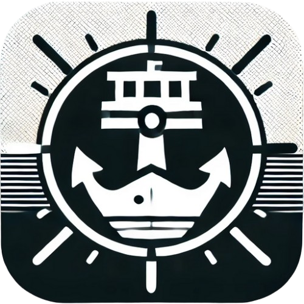

# Port Watch

<p align="center">
  
</p>

A desktop application for monitoring and managing port usage by processes on macOS systems.

## Features

- Real-time port monitoring
- Process search by name
- Process termination capability (with system-critical process protection)
- Automatic refresh every 5 seconds
- Intuitive user interface

## Requirements

- macOS 10.11 or later
- [Go](https://golang.org/dl/) 1.22 or later
- [Fyne](https://developer.fyne.io/) toolkit
- [ImageMagick](https://imagemagick.org/) (for icon generation)

## Installation

1. Install Go 1.16 or higher
2. Clone the project

```bash
git clone https://github.com/Kim-DaeHan/port-watch.git
cd port-watch
```

2. Install dependencies:

   ```bash
   go mod tidy
   ```

3. Install Fyne CLI:

   ```bash
   go install fyne.io/fyne/v2/cmd/fyne@latest
   ```

4. Install ImageMagick (for icon generation):
   ```bash
   brew install imagemagick
   ```

## Running

### Development Mode

```bash
go run main.go
```

### Building the Application

#### 1. Generate Application Icon

```bash
# Create iconset directory
mkdir icon.iconset

# Generate various icon sizes
convert icon.png -resize 16x16 icon.iconset/icon_16x16.png
convert icon.png -resize 32x32 icon.iconset/icon_32x32.png
convert icon.png -resize 64x64 icon.iconset/icon_64x64.png
convert icon.png -resize 128x128 icon.iconset/icon_128x128.png
convert icon.png -resize 256x256 icon.iconset/icon_256x256.png
convert icon.png -resize 512x512 icon.iconset/icon_512x512.png
convert icon.png -resize 1024x1024 icon.iconset/icon_1024x1024.png

# Create .icns file
iconutil -c icns icon.iconset
```

#### 2. Package the Application

```bash
# Remove existing app (optional)
rm -rf "Port Watch.app"

# Package new version
fyne package -os darwin -icon icon.icns
```

## License

[MIT License](LICENSE)

## Developer

- Kim-DaeHan
